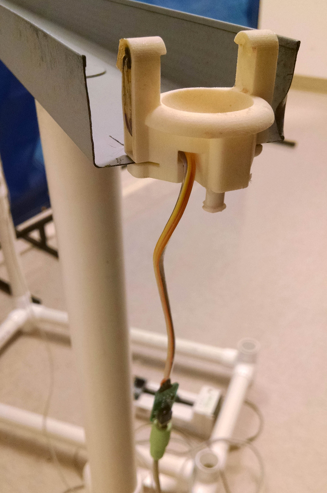

Open Source Design for Liquid Reward in Rodent Behavioral Mazes
======

These reward wells are meant to be installed at the ends of a track. When the animal's breaks the infra-red beam at the right
location, liquid reward is delivered either via a pump or valve-controlled gravity-feed system when the animal. 

### Manufacturing
Designs are provided to 3D print the reward well. We have had success with Shapeways "White Strong and Flexible", as well as
printing in-house on our Afinia 3D printer. To prepare the food well, feed wires through the structure of the food well and
solder them to a 5 mm IR LED (e.g., [Digikey part 751-1210](https://www.digikey.com/product-detail/en/vishay-semiconductor-opto-division/TSHF5210/751-1210-ND/1681345)) and a 5 mm IR phototransistor 
(e.g., [Digikey part 475-1080](http://www.digikey.com/short/7zhpv2)). These wires are sheathed in a thick heatshrink to protect them from being eaten and then then soldered to the interface board. After testing for functionality, we expoy the LED and phototransistor into place. We additionally install a luer connection (Value Plastics [KTFLL-1](http://www.nordsonmedical.com/technical/part_drawings/KFTLL.pdf)) into the liquid feed hole at the bottom of the well.

We have ordered interface boards to be manufactured by Seeed Studio, using their PCBA service, at a cost of ~$2/unit.

